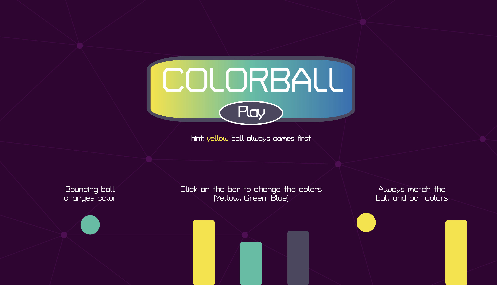

# project-1

## ColorBall

A simple and fun game built by HTML CSS and JS, where the ball will have random color and you have to match it with the stick by click or tap on it. As your scores gettting higher the speed of the game will go faster. You will lose if the color of the stick does not match the ball color, after the game you can share your score with friends through Twitter. 

## Motivation

The game got inspire by a game call "RED OR BLUE" 

##Build Status: Working

##Tech/framework

HTML |  CSS | Javascript | Jquery | Greensock |

GreenSock is a JavaScript framework which makes it easy to animate HTML elements. https://greensock.com/

## User Story:

After the landing page has loaded, you need to click or touch the Play button to start the game, then the sticks will appear you have to click or touch the stick in order to change the color. The ball should appear on top with random color. Your goal is to make the stick match the color with the ball.

## Next 

Try to refactor code and keep it vanilla without side api.
Add Pause and Setting sound in one button;

## Try Me! https://trihod.github.io/project-1/ 
